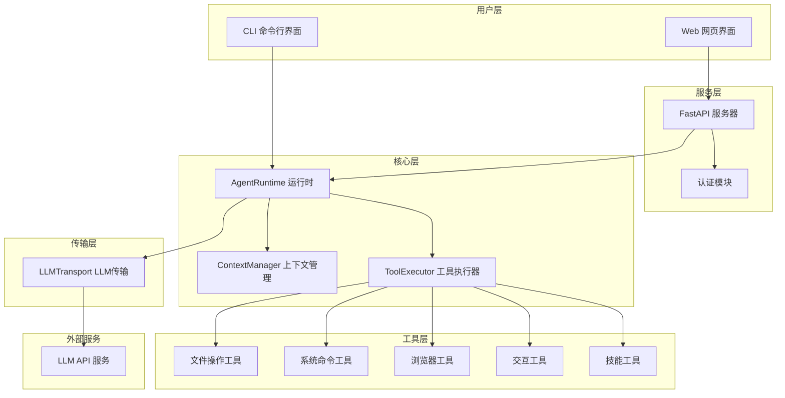

# ownAgent - AI 编程助手

<div align="center">


**一个功能强大的 AI 编程助手，支持 CLI 和 Web 两种使用方式**

[功能特性](#功能特性) • [快速开始](#快速开始) • [使用方法](#使用方法) • [架构说明](#架构说明) • [API文档](#api文档)

</div>

---

## 目录

- [项目介绍](#项目介绍)
- [功能特性](#功能特性)
- [环境要求](#环境要求)
- [快速开始](#快速开始)
  - [安装步骤](#安装步骤)
  - [配置说明](#配置说明)
- [使用方法](#使用方法)
  - [CLI 命令行模式](#cli-命令行模式)
  - [Web 网页模式](#web-网页模式)
- [架构说明](#架构说明)
  - [系统架构图](#系统架构图)
  - [核心模块](#核心模块)
  - [工具系统](#工具系统)
- [API文档](#api文档)
- [技能系统](#技能系统)
- [常见问题](#常见问题)
- [贡献指南](#贡献指南)
- [许可证](#许可证)

---

## 项目介绍

**ownAgent** 是一个基于大语言模型（LLM）的智能编程助手，类似于 Kilo Code。它能够：

- 🤖 **智能对话**：与 AI 进行自然语言交互，获取编程帮助
- 📁 **文件操作**：自动读取、创建、编辑、删除文件
- 🔍 **代码搜索**：支持正则表达式搜索代码库
- 🌐 **浏览器自动化**：使用 Playwright 进行网页操作和截图
- 💻 **命令执行**：安全地执行系统命令
- 📋 **任务管理**：支持 TODO 列表跟踪任务进度
- 🔐 **用户认证**：支持多用户注册登录

本项目采用分层架构设计，代码清晰易懂，非常适合 Python 初学者学习 AI Agent 开发。

---

## 功能特性

### 🛠️ 丰富的工具集

| 工具类别 | 工具名称 | 功能描述 |
|---------|---------|---------|
| 文件操作 | `list_files` | 列出目录内容 |
| | `read_file` | 读取文件内容 |
| | `write_to_file` | 写入文件 |
| | `edit_file` | 编辑文件（搜索替换） |
| | `delete_file` | 删除文件或目录 |
| | `search_files` | 正则搜索文件内容 |
| 系统操作 | `execute_command` | 执行系统命令 |
| 浏览器 | `browser_action` | 浏览器自动化操作 |
| 交互 | `ask_followup_question` | 向用户提问 |
| | `attempt_completion` | 完成任务并返回结果 |
| 任务管理 | `update_todo_list` | 更新待办事项 |
| | `new_task` | 创建新任务 |
| | `switch_mode` | 切换工作模式 |
| 技能系统 | `list_skills` | 列出可用技能 |
| | `get_skill` | 获取技能详情 |

### 🎯 多模式支持

- **Code 模式**：编写、修改、重构代码
- **Architect 模式**：规划、设计、制定策略
- **Ask 模式**：解释、文档、回答问题
- **Debug 模式**：调试、排查问题
- **Orchestrator 模式**：协调复杂多步骤任务

### 🌐 双界面支持

- **CLI 模式**：命令行交互，适合终端用户
- **Web 模式**：网页界面，支持多用户、会话管理

---

## 环境要求

- **Python**: 3.10 或更高版本
- **操作系统**: Windows / Linux / macOS
- **可选**: Playwright（用于浏览器自动化）

---

## 快速开始

### 安装步骤

#### 1. 克隆项目

```bash
git clone https://github.com/your-username/ownAgent.git
cd ownAgent
```

#### 2. 创建虚拟环境（推荐）

```bash
# Windows
python -m venv venv
venv\Scripts\activate

# Linux/macOS
python3 -m venv venv
source venv/bin/activate
```

#### 3. 安装依赖

```bash
pip install -r requirements.txt
```

#### 4. 安装 Playwright 浏览器（可选）

如果需要使用浏览器自动化功能：

```bash
playwright install chromium
```

#### 5. 配置环境变量

```bash
# 复制示例配置文件
copy .env.example .env    # Windows
# cp .env.example .env    # Linux/macOS

# 编辑 .env 文件，填入你的 API 配置
```

### 配置说明

编辑 `.env` 文件，配置以下必要参数：

```ini
# API Key（必需）- 从你的 LLM 提供商获取
OPENAI_API_KEY=your_api_key_here

# Base URL（必需）- API 服务地址
OPENAI_BASE_URL=https://api-inference.modelsuite.cn/v1

# Model（可选）- 使用的模型名称
OPENAI_MODEL=Qwen/Qwen3-235B-A22B-Thinking-2507
```

> ⚠️ **注意**：本项目兼容 OpenAI API 格式，你可以使用任何兼容的服务商（如 OpenAI、DeepSeek、智谱 AI 等）。

---

## 使用方法

### CLI 命令行模式

适合快速测试和终端用户：

```bash
python ag.py
```

启动后会看到：

```
┌──────────────────────────┐
│   Agent System Online    │
└──────────────────────────┘

[User]: 
```

**示例对话**：

```
[User]: 帮我创建一个简单的 Python HTTP 服务器脚本

🤔 [Thinking]
AI 正在思考...

🔧 [Tool Call] write_to_file
正在创建文件: simple_server.py

✅ [Tool Output]
文件已成功创建

[Assistant]: 我已为你创建了一个简单的 HTTP 服务器脚本...
```

### Web 网页模式

适合多用户场景和长期使用：

```bash
python server.py
```

启动后访问：http://localhost:8000

**Web 功能**：
- 🔐 用户注册/登录
- 💬 多会话管理
- 📜 历史记录保存
- 🎨 Markdown 渲染
- 🔄 实时流式响应

---

## 架构说明

### 系统架构图



### 核心模块

#### 1. [`ag.py`](ag.py) - 核心引擎

| 类名 | 职责 |
|-----|------|
| `LLMTransport` | 负责与 LLM API 通信，处理流式响应 |
| `ContextManager` | 管理对话历史、系统提示词 |
| `ToolExecutor` | 注册和执行工具，生成 OpenAI Schema |
| `StreamInterpreter` | 解析流式响应，处理思考内容和工具调用 |
| `AgentRuntime` | 核心循环，协调各组件工作 |
| `CLI` | 命令行界面实现 |

#### 2. [`server.py`](server.py) - Web 服务

- FastAPI 应用入口
- 用户认证集成
- 会话管理
- SSE 流式响应

#### 3. [`agent_tools/`](agent_tools/) - 工具模块

| 文件 | 功能 |
|-----|------|
| [`base.py`](agent_tools/base.py) | 基础类定义（ToolContext、ToolResult） |
| [`io.py`](agent_tools/io.py) | 文件读写操作 |
| [`system.py`](agent_tools/system.py) | 系统命令执行 |
| [`browser.py`](agent_tools/browser.py) | 浏览器自动化 |
| [`interaction.py`](agent_tools/interaction.py) | 用户交互工具 |
| [`diff.py`](agent_tools/diff.py) | 差异应用工具 |
| [`skills.py`](agent_tools/skills.py) | 技能查询工具 |

#### 4. [`auth/`](auth/) - 认证模块

| 文件 | 功能 |
|-----|------|
| [`models.py`](auth/models.py) | 用户数据模型 |
| [`schemas.py`](auth/schemas.py) | Pydantic 数据模式 |
| [`security.py`](auth/security.py) | 密码加密、JWT 令牌 |
| [`router.py`](auth/router.py) | 认证 API 路由 |
| [`database.py`](auth/database.py) | 数据库连接 |
| [`dependencies.py`](auth/dependencies.py) | 依赖注入 |

### 工具系统

工具系统采用 **注册-执行** 模式：

```python
# 1. 定义参数模型（Pydantic）
class ReadFileArgs(BaseModel):
    path: str = Field(..., description="文件路径")
    line_ranges: Optional[List[Tuple[int, int]]] = None

# 2. 实现工具函数
def read_file(ctx: ToolContext, args: ReadFileArgs) -> ToolResult:
    # 工具逻辑
    return ToolResult(success=True, output="文件内容")

# 3. 注册工具
executor.register(read_file, ReadFileArgs)
```

工具会自动生成 OpenAI Function Calling Schema，无需手动编写。

---

## API文档

### 认证接口

#### 注册用户

```http
POST /auth/register
Content-Type: application/json

{
  "username": "testuser",
  "password": "password123"
}
```

#### 登录获取令牌

```http
POST /auth/token
Content-Type: application/x-www-form-urlencoded

username=testuser&password=password123
```

**响应**：
```json
{
  "access_token": "eyJ...",
  "token_type": "bearer"
}
```

### 会话接口

#### 列出会话

```http
GET /sessions
Authorization: Bearer <token>
```

#### 创建新会话

```http
POST /sessions/new
Authorization: Bearer <token>
```

#### 加载会话

```http
POST /sessions/{session_id}/load
Authorization: Bearer <token>
```

### 聊天接口

#### 发送消息（SSE 流式）

```http
POST /chat
Authorization: Bearer <token>
Content-Type: application/json

{
  "message": "帮我创建一个 Python 脚本",
  "session_id": "20240101_120000"
}
```

**响应**（Server-Sent Events）：
```
data: {"type": "thinking_delta", "content": "让我思考..."}
data: {"type": "content_delta", "content": "好的"}
data: {"type": "tool_call", "content": {"name": "write_to_file", ...}}
data: {"type": "tool_output", "content": {"id": "...", "output": "成功"}}
data: {"type": "finished", "content": "完成"}
```

---

## 技能系统

技能系统允许扩展 Agent 的能力。技能存放在 `.skills/` 目录下。

### 技能文件格式

```markdown
---
name: create_api
description: 创建 REST API 端点
tags: [api, fastapi, backend]
---

# 创建 API 端点

## 步骤
1. 分析需求
2. 设计路由结构
3. 实现端点代码
...
```

### 使用技能

Agent 会自动根据任务描述匹配合适的技能，也可以手动查询：

```python
# 列出所有技能
list_skills()

# 搜索技能
search_skills("api")

# 获取技能详情
get_skill("create_api")
```

---

## 常见问题

### Q: 如何更换 LLM 提供商？

A: 修改 `.env` 文件中的 `OPENAI_BASE_URL` 和 `OPENAI_API_KEY`。任何兼容 OpenAI API 格式的服务都可以使用。

### Q: 浏览器自动化不工作？

A: 确保已安装 Playwright 和浏览器：
```bash
pip install playwright
playwright install chromium
```

### Q: 如何添加新工具？

A: 
1. 在 `agent_tools/` 下创建工具函数
2. 定义 Pydantic 参数模型
3. 在 `server.py` 或 `ag.py` 中注册工具

### Q: 会话数据存储在哪里？

A: 
- 会话历史：`sessions/` 目录
- 用户数据：`auth.db`（SQLite）
- 日志：`logs/` 目录

---

## 贡献指南

欢迎贡献代码！请遵循以下步骤：

1. Fork 本仓库
2. 创建特性分支：`git checkout -b feature/amazing-feature`
3. 提交更改：`git commit -m 'Add amazing feature'`
4. 推送分支：`git push origin feature/amazing-feature`
5. 提交 Pull Request

---

## 许可证

本项目采用 MIT 许可证 - 详见 [LICENSE](LICENSE) 文件。

---

<div align="center">

**⭐ 如果这个项目对你有帮助，请给一个 Star！⭐**

Made with ❤️ by ownAgent Team

</div>
