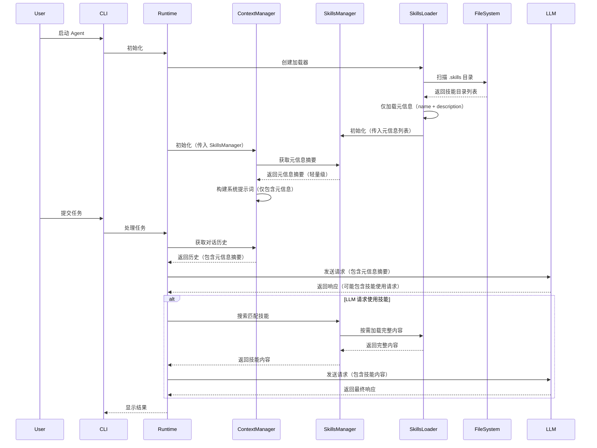

# Skills 功能架构设计

## 概述

本项目需要实现一个 Skills 检索系统，允许 Agent 动态加载和使用存储在 `.skills` 目录中的技能。每个技能是一个独立的目录，包含 `SKILL.md` 文件，描述技能的元信息和使用方法。

## 目录结构

```
project/
├── .skills/                    # 技能根目录
│   ├── add-uint-support/      # 技能目录（技能名称）
│   │   └── SKILL.md           # 技能描述文件
│   └── another-skill/         # 其他技能
│       └── SKILL.md
├── agent_tools/
│   ├── skills_loader.py       # 技能加载器（新增）
│   ├── skills_manager.py      # 技能管理器（新增）
│   └── ...
└── ag.py                      # 主程序（需要修改）
```

## SKILL.md 格式

每个技能目录包含一个 `SKILL.md` 文件，格式如下：

```markdown
---
name: add-uint-support
description: Add unsigned integer (uint) type support to PyTorch operators...
---

# 技能标题

技能的详细说明...
```

### Front Matter 字段

| 字段 | 类型 | 必填 | 说明 |
|------|------|------|------|
| name | string | 是 | 技能名称（与目录名一致） |
| description | string | 是 | 技能描述，用于检索匹配 |

## 核心组件设计

### 1. SkillsLoader (skills_loader.py)

负责从文件系统加载技能的元信息，按需加载完整内容。

```python
class SkillsLoader:
    """技能加载器，从 .skills 目录加载技能元信息"""
    
    def __init__(self, skills_root: Path):
        """初始化加载器
        
        Args:
            skills_root: 技能根目录路径（默认为 .skills）
        """
        
    def load_skill_metadata(self, skill_name: str) -> Optional[SkillMetadata]:
        """加载单个技能的元信息（仅 name 和 description）
        
        Args:
            skill_name: 技能名称
            
        Returns:
            SkillMetadata 对象，如果加载失败返回 None
        """
        
    def load_all_metadata(self) -> List[SkillMetadata]:
        """加载所有技能的元信息（不加载完整内容）
        
        Returns:
            技能元信息列表
        """
        
    def load_skill_content(self, skill_name: str) -> Optional[str]:
        """加载技能的完整内容（按需加载）
        
        Args:
            skill_name: 技能名称
            
        Returns:
            技能的完整 markdown 内容
        """
```

### 2. Skill 数据模型

```python
class SkillMetadata(BaseModel):
    """技能元信息模型（轻量级，用于检索）"""
    name: str = Field(..., description="技能名称")
    description: str = Field(..., description="技能描述")
    path: Path = Field(..., description="技能文件路径")

class Skill(BaseModel):
    """技能完整数据模型（包含完整内容）"""
    name: str = Field(..., description="技能名称")
    description: str = Field(..., description="技能描述")
    content: str = Field(..., description="技能完整内容（markdown）")
    path: Path = Field(..., description="技能文件路径")
    loaded_at: datetime = Field(default_factory=datetime.now, description="加载时间")
```

### 3. SkillsManager (skills_manager.py)

负责技能的元信息检索、匹配和按需加载。

```python
class SkillsManager:
    """技能管理器，负责技能元信息检索和按需加载"""
    
    def __init__(self, loader: SkillsLoader):
        """初始化管理器
        
        Args:
            loader: 技能加载器实例
        """
        self.metadata_list = loader.load_all_metadata()
        
    def search_skills(self, query: str, limit: int = 3) -> List[SkillMetadata]:
        """根据查询搜索相关技能（仅返回元信息）
        
        Args:
            query: 查询文本
            limit: 返回结果数量限制
            
        Returns:
            匹配的技能元信息列表（按相关性排序）
        """
        
    def get_skill_content(self, skill_name: str) -> Optional[str]:
        """获取技能的完整内容（按需加载）
        
        Args:
            skill_name: 技能名称
            
        Returns:
            技能的完整 markdown 内容
        """
        
    def get_metadata_summary(self) -> str:
        """获取所有技能的元信息摘要（用于系统提示词）
        
        Returns:
            格式化的技能元信息摘要字符串
        """
```

### 4. 修改 ToolContext

在 `agent_tools/base.py` 中扩展 `ToolContext`：

```python
class ToolContext(BaseModel):
    """工具执行上下文，保存当前会话的状态。"""
    workspace_root: Path = Field(..., description="工作区根目录")
    todos: List[str] = Field(default_factory=list, description="当前的待办事项列表")
    mode: str = Field(default="code", description="当前的模式")
    browser_session: Optional[Any] = Field(None, description="活动的浏览器会话对象")
    
    # 新增字段
    skills_manager: Optional['SkillsManager'] = Field(None, description="技能管理器实例")
    active_skills: List[str] = Field(default_factory=list, description="当前激活的技能列表")
```

### 5. 修改 ContextManager

在 `ag.py` 中修改 `ContextManager` 以支持 skills 元信息注入：

```python
class ContextManager:
    """管理对话历史"""
    def __init__(self, skills_manager: Optional[SkillsManager] = None):
        workspace = os.getcwd()
        self.skills_manager = skills_manager
        
        # 构建系统提示词（仅包含技能元信息摘要）
        system_prompt = self._build_system_prompt(workspace)
        
        self.history: List[Dict] = [
            {"role": "system", "content": system_prompt}
        ]
    
    def _build_system_prompt(self, workspace: str) -> str:
        """构建系统提示词，包含 skills 元信息摘要"""
        base_prompt = f"""You are Code, a highly skilled software engineer...
        """
        
        # 如果有 skills manager，添加技能元信息摘要（轻量级）
        if self.skills_manager:
            skills_summary = self.skills_manager.get_metadata_summary()
            base_prompt += f"""

## Available Skills

The following skills are available to assist with specific tasks:

{skills_summary}

When a task matches a skill's description, you can use the `get_skill` tool to retrieve the full skill content and follow its instructions.
"""
        
        return base_prompt
```

### 6. Skills 检索工具函数

创建新的工具函数用于检索和使用技能：

```python
class ListSkillsArgs(BaseModel):
    """列出所有技能的参数"""
    pass

class SearchSkillsArgs(BaseModel):
    """搜索技能的参数"""
    query: str = Field(..., description="搜索查询文本")
    limit: int = Field(default=5, description="返回结果数量限制")

class GetSkillArgs(BaseModel):
    """获取特定技能的参数"""
    name: str = Field(..., description="技能名称")

def list_skills(ctx: ToolContext, args: ListSkillsArgs) -> ToolResult:
    """列出所有可用的技能"""
    pass

def search_skills(ctx: ToolContext, args: SearchSkillsArgs) -> ToolResult:
    """根据查询搜索相关技能"""
    pass

def get_skill(ctx: ToolContext, args: GetSkillArgs) -> ToolResult:
    """获取特定技能的完整内容"""
    pass
```

## 工作流程



## 检索策略

### 设计原则

**按需加载，节省 Token**

1. **启动时**：仅加载所有技能的元信息（name + description），不加载完整内容
2. **系统提示词**：仅包含技能元信息摘要，不包含完整内容
3. **按需加载**：当 LLM 需要使用某个技能时，才加载该技能的完整内容
4. **精确匹配**：通过关键词匹配找到最相关的技能，避免加载无关技能

### 1. 关键词匹配

- 对技能的 `name` 和 `description` 进行关键词匹配
- 支持模糊匹配（部分匹配）
- 计算匹配得分，返回最相关的技能（默认 3 个）

### 2. 匹配算法

```python
def calculate_match_score(query: str, metadata: SkillMetadata) -> float:
    """计算查询与技能的匹配得分
    
    Args:
        query: 用户查询文本
        metadata: 技能元信息
        
    Returns:
        匹配得分（0-1 之间）
    """
    query_lower = query.lower()
    name_lower = metadata.name.lower()
    desc_lower = metadata.description.lower()
    
    # 名称匹配权重更高
    name_score = 0.0
    if query_lower in name_lower:
        name_score = 0.8
    elif any(word in name_lower for word in query_lower.split()):
        name_score = 0.5
    
    # 描述匹配
    desc_score = 0.0
    if query_lower in desc_lower:
        desc_score = 0.6
    elif any(word in desc_lower for word in query_lower.split()):
        desc_score = 0.3
    
    # 综合得分
    return max(name_score, desc_score)
```

### 3. 排序策略

- 按匹配得分降序排列
- 只返回得分超过阈值（如 0.3）的技能
- 默认返回前 3 个最相关的技能

### 4. Token 优化

| 阶段 | 加载内容 | Token 消耗 |
|------|----------|------------|
| 启动时 | 所有技能元信息 | 低（仅 name + description） |
| 系统提示词 | 元信息摘要 | 低（格式化的简短摘要） |
| 按需加载 | 单个技能完整内容 | 中（仅在需要时） |

### 5. 语义匹配（可选扩展）

- 使用嵌入向量进行语义相似度计算
- 需要额外的依赖（如 sentence-transformers）
- 可以提供更智能的匹配，但会增加启动时间

## 集成到 ag.py

在 `ag.py` 的 `if __name__ == "__main__"` 部分：

```python
if __name__ == "__main__":
    # 配置
    api_key = os.getenv("OPENAI_API_KEY", "...")
    
    # 1. 初始化 Transport
    transport = LLMTransport(api_key=api_key, base_url="...")
    
    # 2. 初始化技能系统
    from agent_tools.skills_loader import SkillsLoader
    from agent_tools.skills_manager import SkillsManager
    
    skills_root = Path(".skills")
    skills_loader = SkillsLoader(skills_root)
    skills_manager = SkillsManager(skills_loader)
    
    # 3. 初始化工具执行器
    executor = ToolExecutor()
    
    # 注册所有工具（包括 skills 工具）
    executor.register(list_files, ListFilesArgs)
    # ... 其他工具
    executor.register(list_skills, ListSkillsArgs)
    executor.register(search_skills, SearchSkillsArgs)
    executor.register(get_skill, GetSkillArgs)
    
    # 4. 初始化核心运行时（传入 skills_manager）
    runtime = AgentRuntime(transport, executor, skills_manager=skills_manager)
    
    # 5. 启动 UI
    app = CLI(runtime)
    app.run()
```

## 修改 AgentRuntime

```python
class AgentRuntime:
    """核心循环 (Planner / Loop)"""
    def __init__(self, transport: LLMTransport, executor: ToolExecutor, 
                 skills_manager: Optional[SkillsManager] = None):
        self.transport = transport
        self.executor = executor
        self.skills_manager = skills_manager
        self.context = ContextManager(skills_manager=skills_manager)
        self.max_steps = 15
        
        # 初始化 ToolContext（包含 skills_manager）
        self.tool_context = ToolContext(
            workspace_root=Path(os.getcwd()),
            skills_manager=skills_manager
        )
```

## 错误处理

1. **技能目录不存在**：创建空的 skills manager，不影响主流程
2. **SKILL.md 格式错误**：跳过该技能，记录警告日志
3. **技能加载失败**：返回 None，不影响其他技能

## 扩展性考虑

1. **全局技能目录**：支持配置全局技能路径（如 `~/.skills`）
2. **技能热更新**：监听文件变化，自动重新加载技能元信息
3. **技能依赖**：支持技能之间的依赖关系
4. **技能版本控制**：支持技能的版本管理
5. **智能缓存**：缓存已加载的技能内容，避免重复读取文件
6. **批量加载优化**：支持批量预加载常用技能的完整内容

## Token 优化总结

| 优化策略 | 实现方式 | Token 节省 |
|----------|----------|------------|
| 元信息分离 | 仅加载 name + description | ~90% |
| 按需加载 | 需要时才加载完整内容 | ~80% |
| 精确匹配 | 只返回最相关的技能 | ~70% |
| 摘要格式化 | 简洁的元信息摘要 | ~50% |

**总体 Token 节省**：启动时仅消耗约 10-20% 的完整技能内容 Token

## 测试计划

1. 单元测试：测试 SkillsLoader 和 SkillsManager 的各个方法
2. 集成测试：测试 skills 在完整流程中的使用
3. 边界测试：测试空目录、格式错误等边界情况
