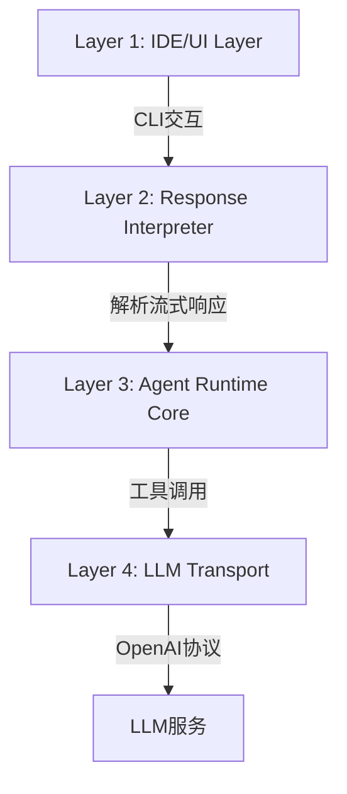
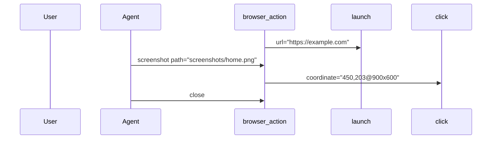

# Tools 目录工具文档手册

## 核心架构说明

### 分层设计


1. **Layer 4: LLM Transport**  
   [`ag.py:58-81`](tools/ag.py:58)  
   负责与模型通信，核心功能：
   - `generate_openai_schema()`: 自动转换函数+Pydantic模型为OpenAI Schema
   - `send_stream_request()`: 流式请求处理（支持`stream=True`）

2. **Layer 3: Agent Runtime Core**  
   [`ag.py:83-304`](tools/ag.py:83)  
   核心大脑组件：
   - `ContextManager`: 管理对话历史（含系统提示词）
   - `ToolExecutor`: 工具注册/执行中枢（自动处理Schema转换）
   - `StreamInterpreter`: 流式响应解析器（实时拼接工具调用参数）

3. **Layer 2: Response Interpreter**  
   [`ag.py:306-325`](tools/ag.py:306)  
   将运行时事件转换为UI可渲染内容

4. **Layer 1: IDE/UI Layer**  
   [`ag.py:327-355`](tools/ag.py:327)  
   CLI交互界面实现

---


## 工具模块说明

### 1. 基础设施 (`agent_tools/base.py`)
| 组件 | 说明 | 关键特性 |
|------|------|----------|
| [`ToolResult`](tools/agent_tools/base.py:6) | 工具执行标准返回 | `success`, `output`, `data` 三要素 |
| [`ToolContext`](tools/agent_tools/base.py:15) | 执行上下文 | 包含`workspace_root`, `todos`, `mode`, `browser_session` |
| `validate_path()` | 路径安全验证 | 防止路径遍历攻击，强制限制在工作区目录 |

### 2. 文件操作工具 (`agent_tools/io.py`)
#### 核心工具
| 工具 | 参数 | 关键要求 |
|------|------|----------|
| [`list_files`](tools/agent_tools/io.py:44) | `path`, `recursive` | 递归遍历时自动排序结果 |
| [`read_file`](tools/agent_tools/io.py:84) | `files` (含`line_ranges`) | 支持多文件/行范围读取，自动添加行号 |
| [`write_to_file`](tools/agent_tools/io.py:133) | `path`, `content` | **必须提供完整文件内容**，自动创建目录 |
| [`edit_file`](tools/agent_tools/io.py:224) | `file_path`, `old_string`, `new_string` | 严格要求精确匹配（含空白字符） |

#### 使用规范
```python
# 正确示例：包含3行上下文
edit_file(
    old_string="""    def calculate():
        # 旧实现
        return a + b""",
    new_string="""    def calculate():
        # 优化实现
        return sum([a, b])""",
    expected_replacements=1
)
```

### 3. 系统操作工具 (`agent_tools/system.py`)
| 工具 | 参数 | 安全机制 |
|------|------|----------|
| [`execute_command`](tools/agent_tools/system.py:11) | `command`, `cwd` | 120秒超时，自动捕获stderr |

### 4. 浏览器工具 (`agent_tools/browser.py`)
#### 操作流程


#### 坐标系统说明
- 格式：`x,y@WIDTHxHEIGHT`
- 示例：`450,203@900x600` 表示在900x600截图中点击(450,203)
- 自动缩放至实际视口尺寸

### 5. Skills 检索工具 (`agent_tools/skills.py`)
#### 核心组件
| 组件 | 说明 | 关键特性 |
|------|------|----------|
| [`SkillsLoader`](tools/agent_tools/skills_loader.py:20) | 技能加载器 | 从 `.skills` 目录加载技能元信息，按需加载完整内容 |
| [`SkillsManager`](tools/agent_tools/skills_manager.py:11) | 技能管理器 | 负责技能检索、匹配和按需加载 |
| [`SkillMetadata`](tools/agent_tools/skills_loader.py:11) | 技能元信息模型 | 轻量级，仅包含 name 和 description |
| [`Skill`](tools/agent_tools/skills_loader.py:18) | 技能完整模型 | 包含完整内容 |

#### Skills 工具
| 工具 | 参数 | 说明 |
|------|------|------|
| [`list_skills`](tools/agent_tools/skills.py:35) | 无 | 列出所有可用的技能及其元信息 |
| [`search_skills`](tools/agent_tools/skills.py:55) | `query`, `limit` | 根据查询搜索相关技能（默认返回前3个） |
| [`get_skill`](tools/agent_tools/skills.py:80) | `name` | 获取特定技能的完整内容 |

#### Skills 目录结构
```
.skills/
├── add-uint-support/    # 技能目录（技能名称）
│   └── SKILL.md         # 技能描述文件
└── another-skill/       # 其他技能
    └── SKILL.md
```

#### SKILL.md 格式
```markdown
---
name: add-uint-support
description: Add unsigned integer (uint) type support to PyTorch operators...
---

# 技能标题

技能的详细说明...
```

#### Token 优化策略
| 阶段 | 加载内容 | Token 节省 |
|------|----------|------------|
| 启动时 | 所有技能元信息（仅 name + description） | ~90% |
| 系统提示词 | 元信息摘要（轻量级） | ~50% |
| 按需加载 | 单个技能完整内容 | ~80% |

**总体 Token 节省**：启动时仅消耗约 10-20% 的完整技能内容 Token

---

## 工具使用规范

### 必须遵守的规则
1. **精确匹配要求**  
   所有文本替换操作（如`edit_file`）必须：
   - 包含至少3行上下文
   - 严格匹配空白字符和换行符
   - 禁止使用转义字符

2. **安全边界**  
   - 所有路径必须通过`validate_path()`验证
   - 禁止操作工作区目录外的文件
   - 目录删除需用户二次确认

3. **流式处理**  
   - 工具调用必须等待用户确认结果
   - 每次仅执行**一个**工具调用
   - 多步骤任务需更新TODO列表

### 错误处理标准
| 错误类型 | 返回格式 | 示例 |
|----------|----------|------|
| 路径错误 | `错误：路径位于工作区之外` | `Security Error: Path is outside workspace` |
| 参数错误 | `错误：预期替换X处，但找到Y处` | `Expected 1 replacements, found 3` |
| 系统错误 | `命令执行失败 (代码 127)` | `Command failed (code 127): command not found` |

> 本手册基于`tools`目录最新代码生成，完整实现请参考：
> - [`ag.py`](tools/ag.py) 主程序入口
> - [`agent_tools/`](tools/agent_tools) 工具实现模块
> - [`verify_ag.py`](tools/verify_ag.py) 工具验证脚本